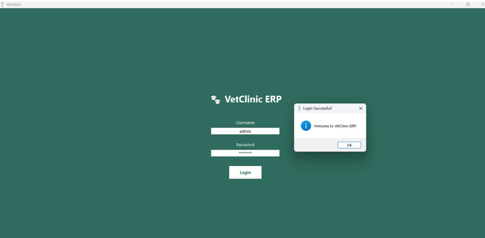
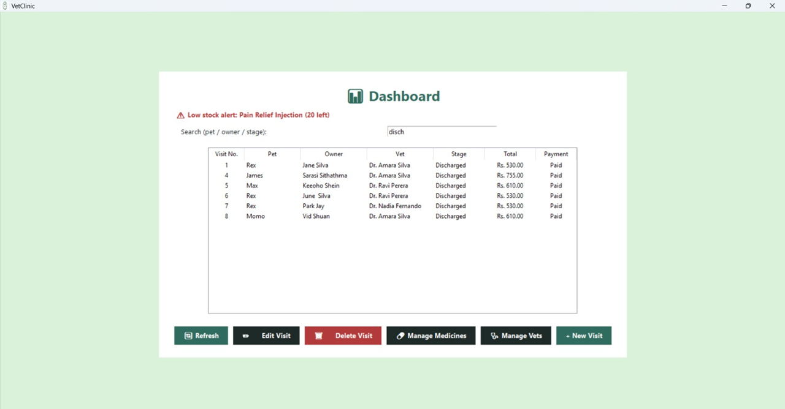
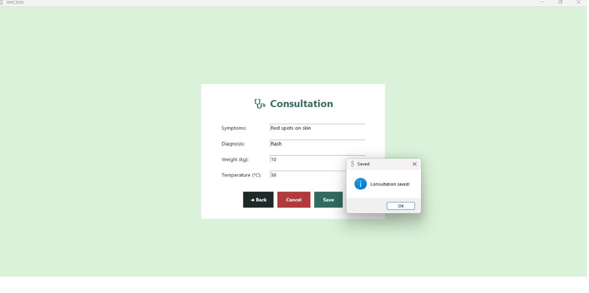
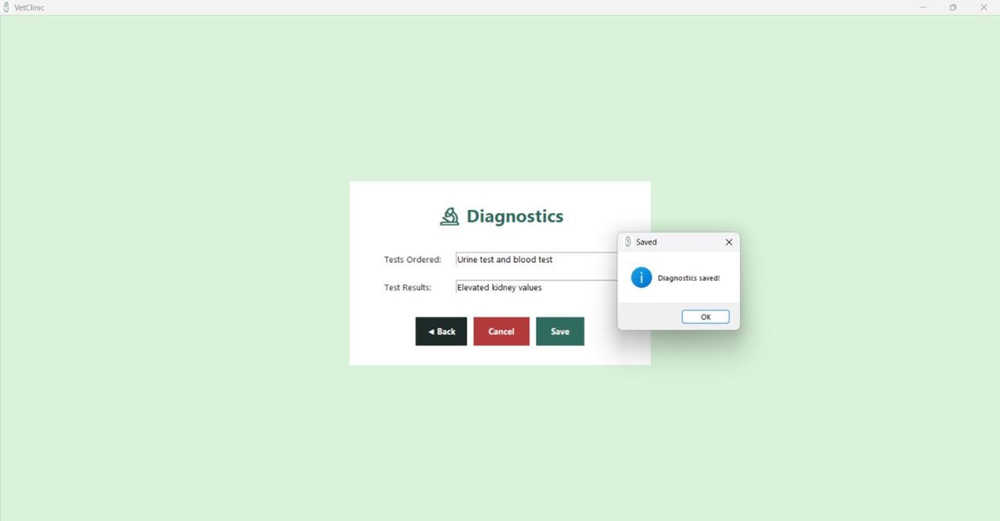
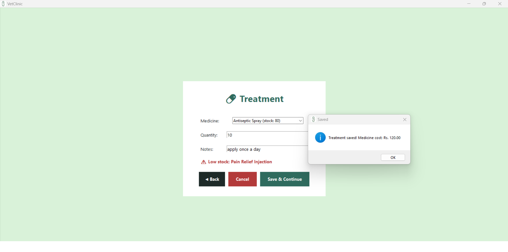
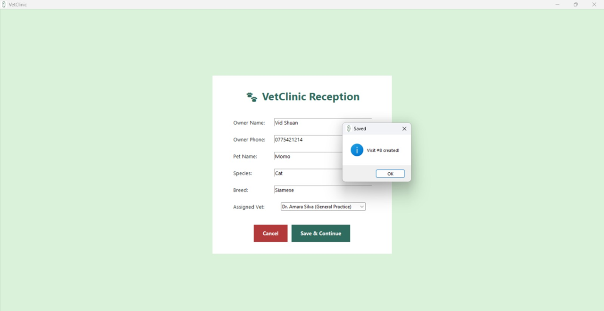
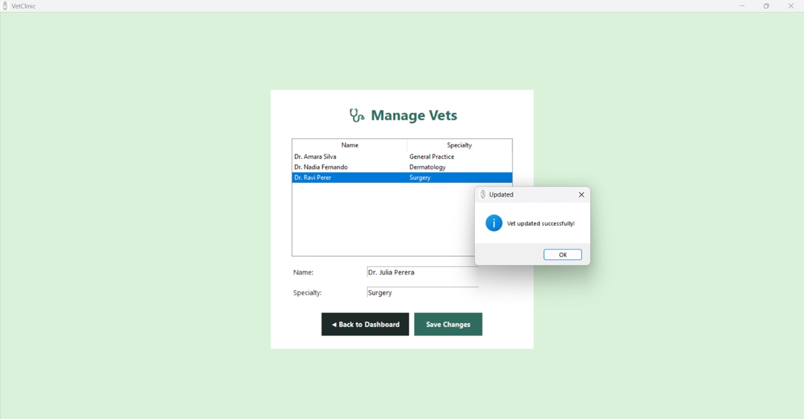

<p align="center">
  
</p>
<h1 align="center">🐾 VetClinic ERP 🩺</h1>

<p align="center">
  <b>Desktop Veterinary Clinic Management System</b><br>
  Built with Python 🐍, Tkinter 🖥️ and SQLite 🗄️
</p>

## Overview 📖
VetClinic ERP is a desktop application that manages the day-to-day operations of a veterinary clinic.It guides each patient visit through a 5-stage process.
1. Reception
2. Consultation
3. Diagnostics
4. Treatment
5. Billing

The system manages pet owners, pets, veterinarians, medicine inventory, patient visits, and billing with all data stored in a local SQLite database.

## Features ✨ 

### 5-stage workflow 🩺
Every patient visit follows the structured workflow below, with the current stage tracked in the database.

### 1. Reception 📝 
- Register the owner and pet
- Open a new patient visit.

### 2. Consultation 💬
- Record symptoms
- Enter diagnosis
- Record weight and body temperature

### 3. Diagnostics 🔬
- Record laboratory tests ordered
- Save diagnostic results

### 4. Treatment💉
- Select prescribed medicine
- Enter medicine quantity
- Automatically check and deduct medicine stock

### 5. Billing 💳
- Calculate consultation fee and medicine cost
- Record payment status
- Discharge the patient

Each stage also includes:

◀  **Back** -  Return to the previous stage

❌ **Cancel** - Cancel the visit and return to the dashboard.

### Dashboard 📊
The dashboard provides an overview of all patient visits.

Features include :
- Live table displaying
   - Pet
   - Owner
   - Veterinarian
   - Current stage
   - Total cost
   - Payment status
- Search visits by:
   - Pet name
   - Owner name
   - Workflow stage
   - Payment status
- One - click ** + New Visit** button to begin a new workflow.

### ✏️ Edit Visit 
Existing visits can be updated without affecting their current workflow stage.

### 💊 Manage Medicines and Manage Vet
A medicine management screen allows staff to :
- Restock medicines
- Update medicine prices
A veterinarian management screen allows staff to update doctors' names and specialties.
 
### 🚨Low Stock Alerts
Medicine at or below a configurable stock threshold are automatically flagged with a **Low Stock** warning.
Alerts appear:
- On the Dashboard
- In the Treatment medicine selection list
This helps ensure medicines are reordered before stock runs out.

### 🔐 Login System
The application includes a simple authentication screen that restricts access before loading.

Default credentials :

-Username :admin
-Password :admin123

### 💰 Consistent Currency Formatting
All monetary values are displayed using a single formatting function, ensuring consistent presentation throughout the application.

### ✅ Input Validation
The application validates user input before saving data.

Validation includes :
- Required fields cannot be left empty.
- Owner phone numbers must contain digits only.
- Numeric validation for : 
 - Weight
 - Temperature
 - Medicine quantity
 - Consultation fee
- Friendly error messages.
- Username and password validation.

### 🛠️ Technology used
Frontend : Python 3 , Tkinter (GUI Framework)
Backend  : SQlite3

Foreign keys are enforced so deleting an owner cascades their pets , and deleting a vet or medicine sets the corresponding visit field to NULL instead of leaving orphaned references.

### 🗂️ Project Structure

```
VetClinic/
├── images/
│   ├── billing.png
│   ├── consultation.png
│   ├── dashboard.png
│   ├── delete_dialogue_box.png
│   ├── diagnostics.png
│   ├── login.png
│   ├── manage_medicine_screen.png
│   ├── manage_vets.png
│   ├── new_visit_reception_screen.png
│   ├── treatment.png
│   └── vetclinic_icon.png
├── app.py
├── init_db.py
├── store.py
├── vetclinic.db
└── README.md

```

## 🖼️ Screenshots

### 🔐 Login Screen


### 📊 Dashboard Showing Low Stock Medicine Alerts


### 📝 Reception Screen


### 💬 Consultation Screen


### 🔬 Diagnostics Screen


### 💉 Treatment Screen


### 💳 Billing Screen


### 💊 Manage Medicines


### 👨‍⚕️ Manage Vets


###  🖥️ app.py
contains :
- Tkinter GUI
- Login screen
- Dashboard
- Reception module
- Consultation module
- Diagnostics module
- Treatment module 
- Billing module

### 🗄️ store.py
Handles all database operations
Functions include :
- Add owner
- Find owner
- Add pet
- Retrieve pets
- Create visit
- Update consultation
- Update diagnostics
- Update treatment
- Finalize billing
- Medicine inventory updates

This file serves as the applications data access layer

###🏗️  init_db.py
Responsible for:
- Creating the SQLite database
- Creating all required tables
- Seeding initial data which is included for Veterinarians, Medicine.

Run this file once before starting the application

## ⚙️ Installation

### 1. Clone the repository

```bash
git clone https://github.com/yourusername/vetclinic-erp.git
cd vetclinic-erp
```
### 2. Install Python

Python 3.10 or newer is recommended.

Download:
https://www.python.org/downloads/

### 3. Create the database

Run:

```bash
python init_db.py
```
This creates:
- The SQLite database
- Required tables
- Initial veterinarian records
- Initial medicine inventory

### 4. Start the application

```bash
python app.py
```

## 🌱 Default Seed Data

### 👨‍⚕️ Veterinarians

- Dr. Amara Silva
- Dr. Ravi Perera
- Dr. Nadia Fernando

### 💊  Medicines

- Amoxicillin 250mg
- Rabies Vaccine
- Deworming Tablet
- Pain Relief Injection
- Antiseptic Spray


### Next Check-up

When billing is completed, the system can automatically calculate a future check-up date.

## 🚀 Key Features

✔ Five-stage patient workflow  
✔ SQLite database integration  
✔ Medicine inventory management  
✔ Low stock alerts  
✔ Search and filtering dashboard  
✔ Authentication system  
✔ Input validation  
✔ Automated billing and next check-up scheduling

---


